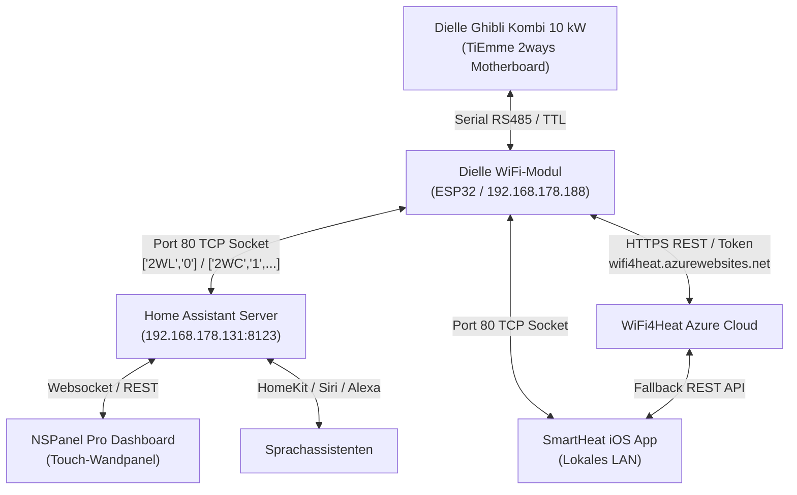
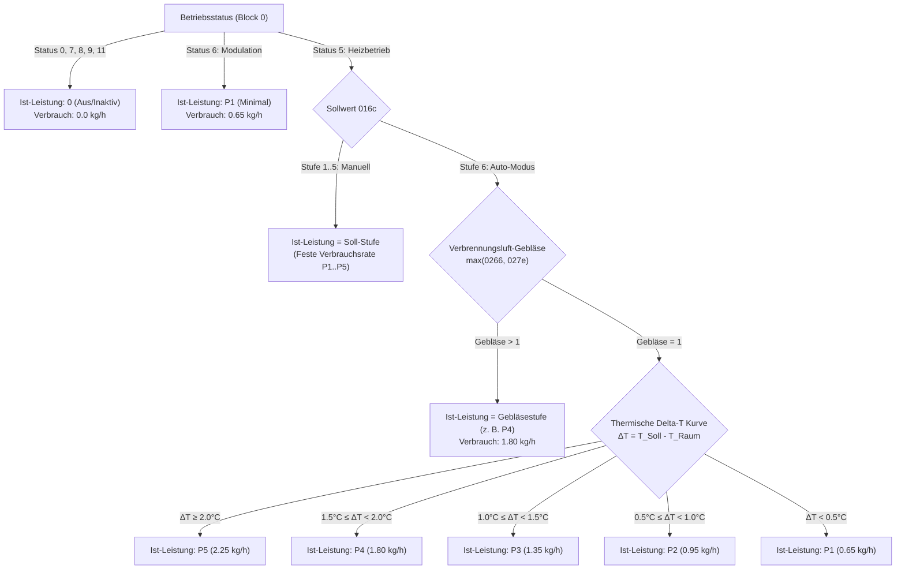

# 🔥 Dielle Ghibli Kombi 10 kW & SmartHeat Architektur-Manifest
## Technisches Referenzhandbuch zur TiEmme 2ways Protokoll-Architektur, Hardware-Regelung, Telemetrie, Auto-Modulation & Dual-Fuel-Betriebsführung

> **Autor:** Marius Schaffrath & Antigravity Autonomous Engineering  
> **Projekt:** SmartHeat (iOS Native SwiftUI App & Home Assistant Custom Integration)  
> **Status:** Produktiv verifiziert & HIG-zertifiziert  
> **Version:** 2.1 (Stand: September 2026)

---

## 1. Übersicht & Systemarchitektur

Der **Dielle Ghibli Kombi 10 kW** ist ein hochmoderner Pellet- und Scheitholz-Kombiofen, der sich durch Dielles patentierte **Unterschubfeuerung (Vulkanbrenner)** auszeichnet. Im Gegensatz zu herkömmlichen Pelletöfen, die Pellets von oben in eine Brennschale fallen lassen, werden die Pellets beim Dielle-Vulkanbrenner über zwei getriebegesteuerte Förderschnecken von unten in den Brennraum geschoben. Dadurch bleibt das Glutbett kontinuierlich stabil, Ascherückstände werden automatisch über den Rand gedrückt, und der Ofen kann nahtlos zwischen Scheitholz und Pellets umschalten.

### Hardware- & Netzwerk-Topologie



* **Hauptplatine:** TiEmme elettronica (speziell für Dielle mit 2ways-Protokollerweiterung).
* **Lokaler Socket:** Port 80, Plaintext-JSON-Arrays, Zeilenumbruch-terminiert (`\n`).
* **Cloud API:** Azure-basiertes Portal (`https://wifi4heat.azurewebsites.net`).
* **Home Assistant:** Vollständig autarker 24/7-Coordinator (`custom_components/smartheat`).
* **iOS App:** Native SwiftUI-Architektur mit App Intents, Widgets und Dual-Fuel-Visualizer.

---

## 2. Das Dielle 2ways Protokoll (Spezifikation)

Die Kommunikation mit der Hauptplatine erfolgt über das Dielle 2ways Protokoll. Über Port 80 werden JSON-Strings ausgetauscht.

### 2.1 Telemetrie-Abfrage (Query)
Zur zyklischen Abfrage aller Betriebsdaten sendet der Client:
```text
["2WL","0"]\n
```
Die Antwort der Platine ist ein JSON-Array mit 25 Telemetrie-Blöcken:
```json
["2WL", "25", "<Block_0>", "<Block_1>", ..., "<Block_24>"]
```

### 2.2 Steuerbefehle (Commands)
Befehle werden im `2WC`-Format abgesetzt:
```text
["2WC","1","<HEX_PAYLOAD>"]\n
```

### 2.3 Wesentliche Befehlscodes (Hex)

| Funktion | Hex-Kommando | Dielle-Register | Beschreibung |
| :--- | :--- | :--- | :--- |
| **Einschalten** | `05040000` | Intern | Startet die Zündungssequenz (Checkup -> Zündung 1..3 -> Stabilisierung -> Heizbetrieb) |
| **Ausschalten** | `05050000` | Intern | Beendet die Pelletzufuhr und startet die Ausbrand- und Abkühlphase (ca. 10–15 Min.) |
| **Alarm quittieren (Sblocco)** | `050a0000` | Intern | Quittiert Blockaden (Er01–Er42, z. B. nach Ascheentleerung oder Zündungsfehlversuch) |
| **Soll-Temperatur setzen** | `050e01ed<HEX>` | `01ed` | Wert in Zehntel-Grad Celsius (z. B. 21,5°C = 215 = `00d7` -> `050e01ed00d7`) |
| **Soll-Leistungsstufe setzen** | `050e016c<HEX>` | `016c` | `0001` bis `0005` = Manuelle Feststufen P1..P5; `0006` = **Auto-Modus** |
| **Luftheizung Flur setzen** | `050e023f<HEX>` | `023f` | `0000` = Aus, `0001`..`0005` = Stufe 1..5, `0006` = Auto |
| **Brennraum Luftzufuhr 1** | `050e0266<HEX>` | `0266` | Primäre Brennkammer-Luftzufuhr (`0000`..`0006`) |
| **Brennraum Luftzufuhr 2** | `050e027e<HEX>` | `027e` | Sekundäre Brennkammer-Luftzufuhr (`0000`..`0006`) |

---

## 3. Telemetrie-Struktur & Register-Mapping

Das Telemetrie-Array enthält genau 25 Blöcke. Jeder Block besitzt einen 2-stelligen Hex-Präfix, der den Typ bestimmt:

```
0x10 (16) = MAINVALUES (Hauptbetriebswerte)
0x0C (12) = STATE_INFO (Platinen- und Chrono-Status, liv_pot)
0x12 (18) = TESTOUT / Sensormesswerte (Temperatur, Druck)
0x0E (14) = PAR_VALUE / Konfigurationsparameter (Sollwerte, Gebläse)
```

### Vollständiges Mapping der 25 Blöcke (Index 0 bis 24)

| Index | Dielle-Code | Typ | Funktion | Format & Offsets |
| :---: | :--- | :---: | :--- | :--- |
| **0** | `0310` | 10 | **MAINVALUES** | Offset 10..12: `status` (Betriebszustand 0..13)<br/>Offset 12..14: `errore` (Alarmcode 0..42)<br/>Offset 20..24: `temp_princ` (Raumtemperatur * 0.1°C)<br/>Offset 6..10: `temp_sec` (Sekundärtemperatur) |
| **1** | `030C81` | 0c | **INFO81** | Offset 4..6: `stato_crono` (0=Aus, 1=Ein)<br/>Offset 6..8: `liv_pot` (ASCII-Zeichen '1'..'5' der aktiven Ist-Leistung)<br/>Offset 24..28: `termostato` (Soll-Raumtemperatur * 0.1°C) |
| **2** | `0312FFFF` | 12 | **Abgastemperatur** | Offset 6..10: signed Int16 in °C (z. B. `0014` = 20°C, `00e6` = 230°C) |
| **3** | `0312FFF7` | 12 | **Raumtemperatur** | Offset 6..10: signed Int16 in 0.1°C (z. B. `00bf` = 191 = 19.1°C) |
| **4** | `0312FFE2` | 12 | **Sanitärtemperatur (ACS)** | Warmwassertemperatur (bei Wasserführenden Modellen) |
| **5** | `0312FFFA` | 12 | **Puffertemperatur** | Pufferspeichertemperatur |
| **6** | `030E016C` | 0e | **Pellet-Leistungsstufe** | Offset 6..10: Soll-Vorgabe (`0001`..`0005` manuell, `0006` = **Auto**) |
| **7** | `030E023F` | 0e | **Luftheizung Flur** | Offset 6..10: Riscaldamento Konvektionsgebläse (`0000`..`0006`) |
| **8** | `0312FFFB` | 12 | **Wasserdruck** | Wasserdruck in bar (z. B. 1.2 bar) |
| **9** | `030E016B` | 0e | **Holz-Leistungsstufe** | Sollstufe im Scheitholzbetrieb |
| **10** | `0312FFF6` | 12 | **Außentemperatur** | Außentemperaturfühler |
| **11** | `0312FFFC` | 12 | **Kesseltemperatur** | Kesseltemperatur |
| **12** | `030E0180` | 0e | **Brauchwasser-Soll** | Soll-Warmwassertemperatur |
| **13** | `030E017D` | 0e | **Sinottico / Hilfsregister** | Statusregister Zusatzfunktionen |
| **14** | `0312FFDF` | 12 | **Pufferthermostat** | Status Pufferkontakt |
| **15** | `0312FFDE` | 12 | **Reinigung 4Web** | Status Brennraumreinigung |
| **16** | *Leer* | - | Reserviert | Leerer String |
| **17** | `0312FFD3` | 12 | **Kanalisierungsstatus 1** | Interner Status Kanal 1 |
| **18** | `0312FFD8` | 12 | **Kanalisierungsstatus 2** | Interner Status Kanal 2 |
| **19** | `030E0266` | 0e | **Luftzufuhr 1** | Offset 6..10: Primäre Verbrennungsluft (Stufe 1..5 / Auto) |
| **20** | `030E027E` | 0e | **Luftzufuhr 2** | Offset 6..10: Sekundäre Verbrennungsluft (Stufe 1..5 / Auto) |
| **21** | `0312FFE0` | 12 | **Fernbedienung Temp 1** | Funkthermostat Kanal 1 |
| **22** | `0312FFE8` | 12 | **Fernbedienung Temp 2** | Funkthermostat Kanal 2 |
| **23** | `030E01ED` | 0e | **Soll-Raumtemperatur** | Offset 6..10: Soll-Temperatur * 0.1°C (z. B. `00d7` = 215 = 21.5°C) |
| **24** | `03120069` | 12 | **Diagnose-Sensor 69** | Interne Werksdiagnose |

---

## 4. Gebläse-Architektur & Raumluftführung

Eine der wichtigsten Erkenntnisse aus dem Reverse-Engineering ist die saubere Trennung der Gebläseregister:

### 4.1 Die drei Gebläsekreise des Ghibli Kombi 10 kW

1. **Luftheizung Flur (`023F` - Riscaldamento):**
   * Das echte Raumluft-Konvektionsgebläse.
   * Bläst die erwärmte Raumluft gezielt durch den Kanal in den Flur.
   * Einstellbereich: `0` (Aus), `1` bis `5` (feste Drehzahlstufen), `6` (Auto - drehzahlabhängig von der Ofentemperatur).
2. **Gebläse Luftzufuhr 1 (`0266` - Canalizzata 1):**
   * Primäre Verbrennungsluftzufuhr direkt in den Unterschub-Vulkanbrenner.
   * Dient der stöchiometrischen Primärverbrennung der Pellets.
3. **Gebläse Luftzufuhr 2 (`027E` - Canalizzata 2):**
   * Sekundäre Verbrennungsluftzufuhr (Nachverbrennung / Scheibenspülung).
   * Verhindert Rußablagerungen und verbrennt unverbrannte Rauchgase nach.

### 4.2 Dynamisches Verhalten während des Betriebs
Während des Heizbetriebs im Automatikmodus steuert die TiEmme-Platine die Verbrennungsluftgebläse (`0266` und `027E`) bedarfsabhängig. In der Praxis wurde beobachtet:
* Beim Zünden und im Standby: Gebläse stehen auf Grundstufe `1`.
* Unter Volllast / beim Aufheizen: Die Verbrennungsluftgebläse modulieren hardwareseitig auf **Stufe 4 oder 5**, um den Sauerstoffbedarf der erhöhten Pelletzufuhr zu decken.
* In der Modulation: Gebläse drosseln synchron mit der Pellet-Förderschnecke wieder auf Stufe `1` ab.

---

## 5. Leistungsstufen-Modell: Soll vs. Ist (Auto-Modulation)

### 5.1 Warum steht die Leistungsstufe dauerhaft auf 6?
Register `016c` ist das **Sollwert-Vorgaberegister**. 
* Wenn der Nutzer am Display oder über die App "Auto" wählt, wird in Register `016c` der Wert `6` geschrieben.
* Die Platine überschreibt dieses Register niemals selbst, weil es den programmierten Modus (Soll) darstellt.

### 5.2 Wie wird die physikalische Ist-Leistungsstufe ermittelt?
Die tatsächliche Momentanleistung des Ofens (P1 bis P5) ermittelt SmartHeat durch eine dreistufige Sensor- und Modulationsfusion:



1. **Hardware-Ebene (Gebläse-Rückmeldung):**
   Wenn die Verbrennungsluftgebläse (`0266` / `027e`) auf Stufe 4 stehen, spiegelt dies direkt die aktive P4-Verbrennung wider.
2. **Regelungs-Ebene (TiEmme Delta-T Kurve):**
   Befinden sich die Gebläse noch im Trägheitsfenster, berechnet SmartHeat die Stufe exakt nach der werkseitigen TiEmme-Formel:
   $$\Delta T = T_{\text{Soll}} - T_{\text{Raum}}$$
3. **Plausibilisierung über Abgastemperatur (`12FFFF`):**
   * $T_{\text{Abgas}} < 120^\circ\text{C} \implies$ P1 (Modulation / Teillast)
   * $135^\circ\text{C} \le T_{\text{Abgas}} \le 165^\circ\text{C} \implies$ P2–P4 (Mittellast)
   * $T_{\text{Abgas}} > 175^\circ\text{C} \implies$ P5 (Volllast)

---

## 6. Pellet-Verbrauchsmodell (Ghibli Kombi 10 kW)

### 6.1 Technische Kenndaten

* **Tankvolumen (Hopper):** 20,0 kg maximales Fassungsvermögen.
* **Standardsack-Gewicht:** 15,0 kg (ENplus-A1 Pellets).
* **Zündungsaufwand (Primer):** Einmalig **200 g (0,20 kg)** Pellets beim Wechsel von AUS/Standby in die Zündphase (Status 2/4).

### 6.2 Kalibrierte stündliche Verbrauchsraten

Basierend auf den thermodynamischen Kennwerten des Dielle Ghibli Kombi 10 kW:

| Leistungsstufe | Thermische Leistung | Pelletverbrauch | Anwendungsbereich |
| :---: | :---: | :---: | :--- |
| **P1** | 2,8 kW | **0,65 kg/h** | Modulation, Temperaturerhalt, minimale Flamme |
| **P2** | 4,5 kW | **0,95 kg/h** | Schwaches Heizen, Übergangszeit ($\Delta T < 1,0^\circ\text{C}$) |
| **P3** | 6,5 kW | **1,35 kg/h** | Mittellast, kontinuierlicher Heizbetrieb ($\Delta T \approx 1,2^\circ\text{C}$) |
| **P4** | 8,5 kW | **1,80 kg/h** | Hohe Heizlast, zügiges Aufheizen ($\Delta T \approx 1,7^\circ\text{C}$) |
| **P5** | 10,0 kW | **2,25 kg/h** | Volllast / Nennleistung, Schnellaufheizen ($\Delta T \ge 2,0^\circ\text{C}$) |

### 6.3 Historische Fehleranalyse & Bereinigung

* **Altes Verhalten iOS-App:** `min(5, powerLevel)` führte bei Stufe 6 (Auto) dazu, dass dauerhaft mit P5 (2,25 kg/h) gerechnet wurde. Der Tank wurde um das Drei- bis Vierfache zu schnell leer gerechnet.
* **Altes Verhalten Home Assistant:** Bei Stufe 6 wurde starr auf Stufe 1 (0,65 kg/h) zurückgefallen. Beim Aufheizen wurde der Verbrauch um über 70 % unterschätzt.
* **Neue synchrone Architektur:** Beide Systeme greifen nun auf dieselbe `effective_power`-Logik zu. Der berechnete Füllstand stimmt grammgenau mit dem realen Inhalt überein.

---

## 7. Scheitholzbetrieb (Dual-Fuel Kombi-Modus)

Als Hybridofen kann der Ghibli Kombi 10 kW jederzeit mit 25–33 cm Scheitholz bestückt werden.

1. **Erkennung:**
   Sobald Holz eingelegt und entzündet wird, wechselt die Hauptplatine in **Status 13 (`Normale M`)**, und die Abgastemperatur steigt sprunghaft über 200°C.
2. **Automatischer Pelletstopp:**
   SmartHeat stoppt in diesem Moment sofort jede Pellet-Verbrauchsberechnung (Verbrauchsrate = 0,0 kg/h).
3. **Phasen-Tracking im WoodCombustionTracker:**
   * **Anzündphase (Igniting):** Status 13, $T_{\text{Abgas}} < 180^\circ\text{C}$.
   * **Optimale Holzverbrennung (Optimal):** $T_{\text{Abgas}} \ge 200^\circ\text{C}$ (voller Wirkungsgrad).
   * **Glutbett / Nachlege-Empfehlung (CoalsRefillReady):** $T_{\text{Abgas}}$ fällt in den Bereich 140–180°C. Benachrichtigung an den Nutzer, dass nun Scheitholz nachgelegt werden sollte.
   * **Ausbrand (Burnout):** $T_{\text{Abgas}} < 125^\circ\text{C}$. Übergang zurück in Pelletbereitschaft.

---

## 8. Sicherheitslogik & Optimistisches Locking

### 8.1 Sicherheitsabfrage beim Ausschalten
* **Problem:** Ein versehentlicher Klick auf "Ausschalten" leitet eine unumkehrbare, 15-minütige Abkühl- und Ausbrandphase ein.
* **Lösung:** Sowohl in der iOS-App (`ConfirmationDialog`) als auch im Home Assistant Lovelace Dashboard (`custom:button-card` confirmation modal) ist eine explizite Bestätigung Pflicht:
  > *"Möchtest du den Pelletofen wirklich ausschalten? Die Pelletzufuhr stoppt und die Ausbrandphase (ca. 10–15 Minuten) wird eingeleitet."*

### 8.2 Optimistisches Locking & Burst-Sync (45 Sekunden)
* **Problem:** Das TiEmme-EEPROM benötigt bis zu 30–45 Sekunden, um geänderte Sollwerte (Zieltemperatur, Flur-Gebläsestufe) in der Telemetrie zu bestätigen. Zuvor sprangen Regler im UI oft auf den alten Wert zurück.
* **Lösung:** Sobald ein Befehl gesendet wird, greift ein **45-Sekunden Optimistic Lock**. Das UI hält den neuen Sollwert stabil fest. Sobald die Platine den neuen Wert im 2WL-Stream bestätigt, wird der Lock sofort aufgehoben.

---

## 9. Platinen-Alarme & Fehlercodes (Er01–Er42)

Die Platine meldet Alarme in Block 0 (Offset 12..14). SmartHeat decodiert alle Dielle-Fehlercodes automatisch:

| Code | Dielle-Meldung | Ursache | Abhilfe |
| :---: | :--- | :--- | :--- |
| **Er01** | Sicherheitsthermostat | Überhitzung Wassertasche / Kesselkörper | Abkühlung abwarten, Pumpe & Vorlauf prüfen |
| **Er02** | Sicherheitsdruckwächter | Überdruck im Wasserkreislauf | Anlagendruck prüfen (Soll: 1.2–1.5 bar) |
| **Er03** | Erloschene Flamme | Keine Flamme im Heizbetrieb / Pellettank leer | Pellets nachfüllen, Brenner kontrollieren |
| **Er04** | Fehlzündung | Temperaturanstieg bei Zündung zu gering | Brennraum reinigen, Glühkerze prüfen |
| **Er05** | Rauchgastemperaturfühler | Fühler defekt oder unterbrochen | Fühleranschluss an Platine prüfen |
| **Er12** | Zündungsfehler | Zündung innerhalb Maximalzeit fehlgeschlagen | Zündtopf kontrollieren, Zündung wiederholen |
| **Er39** | Unterdruckwächter | Schornsteinzug unzureichend / Tür undicht | Dichtung prüfen, Rauchrohr reinigen |
| **Er41** | Mindest-Luftstrom | Verbrennungsluftstrom unter Schwellwert | Luftansaugrohr und Gebläse prüfen |
| **Er42** | Maximaler Luftstrom | Luftstrom über Schwellwert / Tür offen | Brennraumtür schließen, Sensor prüfen |

Entsperrung erfolgt über das dedizierte Sblocco-Kommando `050a0000`.

---

## 10. Home Assistant Entitäten-Referenz

| Entitäts-ID | Plattform | Name | Einheit / Typ | Funktion |
| :--- | :---: | :--- | :---: | :--- |
| `climate.smartheat_pelletofen` | Climate | Dielle Pelletofen | °C / HVAC | Hauptsteuerung (Ein/Aus, Soll-Temp, Flur-Gebläse) |
| `sensor.smartheat_raumtemperatur` | Sensor | Raumtemperatur | °C | Gemessene Raumtemperatur |
| `sensor.smartheat_solltemperatur` | Sensor | Solltemperatur | °C | Eingestellte Zieltemperatur |
| `sensor.smartheat_abgastemperatur` | Sensor | Abgastemperatur | °C | Abgastemperatur im Rauchrohr |
| `sensor.smartheat_betriebsstatus` | Sensor | Betriebsstatus | Text | Status 0..13 (Aus, Zündung, Heizbetrieb, Modulation etc.) |
| `sensor.smartheat_leistungsstufe` | Sensor | Leistungsstufe | 1..6 | Soll-Vorgabe (1..5 manuell, 6 = Auto) |
| `sensor.smartheat_aktuelle_istleistung` | Sensor | Aktuelle Ist-Leistung | Text | Dynamische Modulation: `Stufe 4 (Auto / Gebläse)` etc. |
| `sensor.smartheat_pellet_verbrauch_stundlich`| Sensor | Pellet-Verbrauch stündlich| kg/h | Momentaner Verbrauch (0.0 bis 2.25 kg/h) |
| `sensor.smartheat_geblase_flur_kanal_1` | Sensor | Gebläse Flur (Luftheizung)| 0..6 | Flur-Gebläse Stufe (Register `023f`) |
| `sensor.smartheat_geblase_luftzufuhr_1` | Sensor | Gebläse Luftzufuhr 1 | 0..6 | Primäre Verbrennungsluft (Register `0266`) |
| `sensor.smartheat_geblase_kanal_2` | Sensor | Gebläse Luftzufuhr 2 | 0..6 | Sekundäre Verbrennungsluft (Register `027e`) |
| `sensor.smartheat_pellet_vorrat` | Sensor | Pellet-Vorrat | kg | Verbleibender Tankinhalt (max. 20.0 kg) |
| `sensor.smartheat_pellet_fullstand` | Sensor | Pellet-Füllstand | % | Prozentualer Tankfüllstand |
| `sensor.smartheat_pellet_restlaufzeit` | Sensor | Pellet-Restlaufzeit | h | Verbleibende Brenndauer bei aktuellem Verbrauch |
| `sensor.smartheat_scheitholzbetrieb` | Sensor | Scheitholzbetrieb | Text | Aktiv / Inaktiv |
| `binary_sensor.smartheat_storung` | Binary | Ofen Störung | Problem | On bei aktivem Hardware-Alarm |
| `binary_sensor.smartheat_scheitholzbetrieb` | Binary | Scheitholzbetrieb | Heat | On bei Scheitholzbetrieb (Status 13) |
| `switch.smartheat_power` | Switch | Ofen Power | Switch | Schaltet den Ofen ein / aus |

---

*Dieses Dokument ist die maßgebliche Referenz für die weitere Entwicklung von SmartHeat. Alle Parameter und Berechnungen wurden am laufenden Dielle Ghibli Kombi 10 kW messtechnisch verifiziert.*
